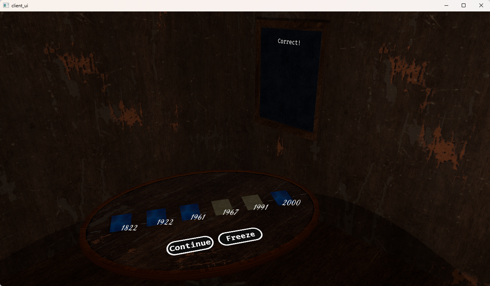

# Chronology Game

---




## About this project
This project was developed as part of the 7.5 credit, Rust programming course (d7082e) at Luleå University of Technology (LTU), running from January to March 2025.

This assignment started with a command line implementation of the Chronology card game and was then turned into a online version by adopting a client-server solution communicating over a TCP socket. The assignment then continued with two additional, optional, parts towards that granted higher grade. The first part involved making the game multiplayer and the final part involved crating a User Interface for the game client.

I passed this course with highest grade and exceptional feedback.

If you want to know more about the assignment instructions you can read the [ASSIGNMENT.md](docs/ASSIGNMENT.md) document. You may also read a brief summary about the design of the implementation, documented in [GAME_DESIGN.md](docs/GAME_DESIGN.md).

## Installation

Install the game by cloning this git repository.

The following steps provide instructions for running the game client and server:

### Server

In order to install and run the server, run the following command in a terminal window:

```bash
cargo run -p game_server --release
```

### Client

In order to install and run the clint(s), run the following command in a terminal window. Remember to use one terminal window for each client:

```bash
cargo run -p client_ui --release 
```

If you are running WSL2 with GUI support you may have to start the client(s) with the following command:

```bash
WAYLAND_DISPLAY= WINIT_PLATFORM=x11 cargo run -p client_ui
```

> **_NOTE:_**  The game has only been tested on Windows and MacOs, therefore issues might occur if the user is trying to run the game on other platforms.

## General Information

Run the game by first starting the server. After that start the client(s). The first client that entered its name will be "session owner" meaning that it's this client that will be responsible for starting the game once all other players have joined (this is done by pressing enter in the terminal window).

Once the game is running, each player take turn to guess. If a player disconnects the game will continue without this player, and once reconnected the player will be in the same state as before.

* If the sound is annoying you can mute it by pressing `M`, and if you miss it just press `M` again.
* Remove the `--release` flag to allow debug messages.
* Run all tests with `cargo test`
* Generate documentation using `cargo doc --open`, this operation usually takes long time, it's therefore recommended to add the `--no-deps` flag in order to exclude documentation of all dependencies.

> **_NOTE:_** Some tests establishes TCP connections, and if the IP and Port is used by other processes the test will fail.
